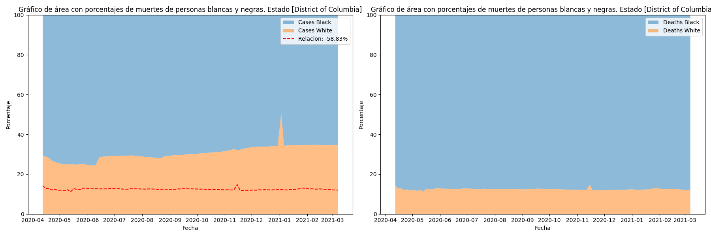

# Mineria-Solemne-1

# Análisis de datos Covid-19

## Impacto de muertes con diferencia racial en Estados Unidos

En el presente desarrollo se quiere identificar la influencia racial dados los Casos/Muerte presentes en los Estados Unidos.

EL conjunto de datos disponibles son principalmente 91 fechas distribuidas en inicio de Abril del 2020 hasta Abril del 2021 un año aproximadamente.

Para comprender el análisis, la primera gráfica muestra una relación del 100% de los Casos confirmados (personas Blancas y Negras) en cada fecha y la segunda hace lo mismo pero en el caso de las Muertes.

La línea roja representa la relación en las Muertes y el número en la leyenda es el cálculo del error porcentual absoluto que compara la relación de Casos y Muertes, para ver cómo de diferente es y por último, el signo positivo o negativo señaliza si (+) murieron más personas blancas o (-) si murieron más personas negras.

Existen en total unos 56 conjuntos de estados, territorios y posesiones. De los cuales los más destacados son:

- Connecticut: 11.13%

- Delawere: 24.32%

- Distric of Columbia: -58.83%

- Florida: 11.99%

- Hawaii: -10.95%

- Maine: 18.40%

- Maryland: 16.50%

- Massachusetts: 14.38%

- Michigan: -11.05%

- Minnesota: 20.75%

- Mississipipi: 10.29%

- Ohio: 11.77%

- Rhode island: 18.30%

- South Dakota: 18.56%

- Texas: 15.37%

- Virginia: 10.26%

En todos los demás estados o territorios los cambios están por debajo de 10%, incluso por debajo del 5%, dando que en el 28% de los estados, presentan una cualidad atípica.

Como se ve en los estados, principalmente las personas de raza blanca mueren más. Entre los estados con más población adulta solo está Maine y Florida, lo cual no representa un motivo significativo de este cambio.

Además de los estados posibles estados más racistas solo hay tres: Mississippi, Texas y Virginia.

Lo que se puede concluir es que las personas de raza blanca tenían más tendencia a morir que las de raza negra, por lo que en el presente análisis no existió una discriminación racial hacia la gente negra, pero al parecer existe una componente de vulnerabilidad para la gente blanca.

