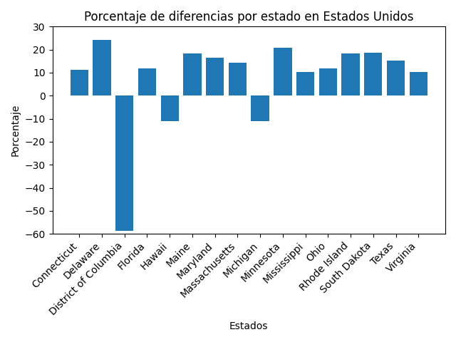
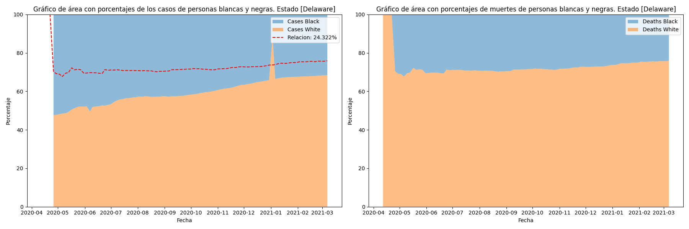
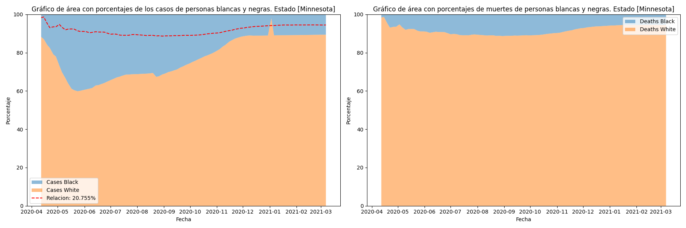
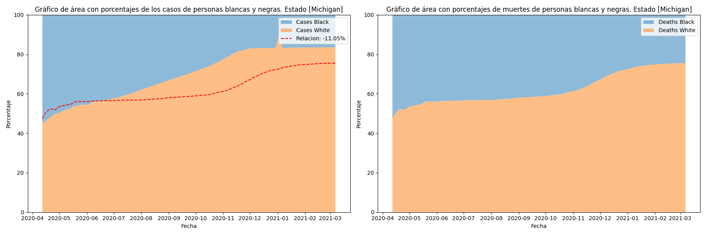

# Mineria-Solemne-1

# Análisis de datos Covid-19

## Impacto de muertes con diferencia racial en Estados Unidos

En el presente desarrollo se quiere identificar la influencia racial dados los Casos/Muerte presentes en los Estados Unidos.

Los datos obtenidos son de la API Latest Covid-19 de Bigquery, en especifico de "covid19_tracking: covid_racial_data_tracker".

EL conjunto de datos disponibles son principalmente 91 fechas distribuidas en inicio de Abril del 2020 hasta Abril del 2021 un año aproximadamente.

### Resumen

En este análisis se investigó el impacto racial que tuvo lugar durante la pandemia, con el fin de encontrar indicadores de discriminación racial.

### Análisis indirecto.

Para comprender el análisis, los graficos represnetan una relación del 100% (es decir tomar la cantidad de personas blancas y personas negras como el total) para tener una referencia base para comarar, en este caso los Casos confirmados y en segundo lugar la Mortalidad.

Personas de Blancas [Azul] y Negras [Naranjo] .

La línea roja representa la relación en las Muertes y el número en la leyenda es el cálculo del error porcentual absoluto que compara la relación de Casos y Muertes, para ver cómo de diferente es y por último, el signo positivo o negativo señaliza si (+) murieron más personas blancas o (-) si murieron más personas negras.

Existen en total unos 56 conjuntos de estados, territorios y posesiones. De los cuales los más destacados son:

- Connecticut: 11.13%

- Delawere: 24.32%

- Distric of Columbia: -58.83%

- Florida: 11.99%

- Hawaii: -10.95%

- Maine: 18.40%

- Maryland: 16.50%

- Massachusetts: 14.38%

- Michigan: -11.05%

- Minnesota: 20.75%

- Mississipipi: 10.29%

- Ohio: 11.77%

- Rhode island: 18.30%

- South Dakota: 18.56%

- Texas: 15.37%

- Virginia: 10.26%

En todos los demás estados o territorios los cambios están por debajo de 10% y dando que en el 28% de los estados, presentan una cualidad atípica.

Como se ve en los estados, principalmente las personas de raza blanca mueren más. Entre los estados con más población adulta solo está Maine y Florida, lo cual no representa un motivo significativo de este cambio.

 Los casos (-) son solo 18% de los destacados y es solo el 5% entre todos los estados.

Además de los estados posibles estados más racistas solo hay tres: Mississippi, Texas y Virginia. Por lo que no hay una relacion estrecha.

Lo que se puede concluir es que las personas de raza blanca tenían más tendencia a morir que las de peronas de raza negra. Lo que significa que no existio una discriminación racial hacia las personas negras, pero al parecer existe una componente de vulnerabilidad para las personas blancas.

